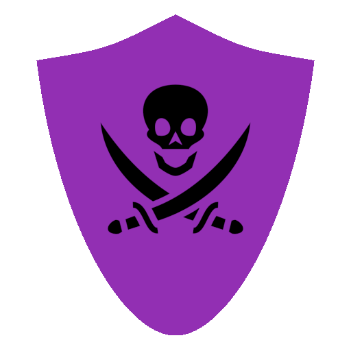

# ScamAway
The Anti-Phishing Discord Bot

## What's this?
ScamAway is a Discord bot that aims to keep your servers free from annoying phishing links by detecting known domains, and has other related features

[Invite the publicly hosted version](https://discord.com/api/oauth2/authorize?client_id=934294961686478858&permissions=1394254146630&scope=bot%20applications.commands)

Looking for the API behind this? Head to https://github.com/Xenorio/ScamAway-API

## Features
- Automatic detection of malicious links
- Choose what happens when a message is detected (delete, kick, ban)
- Report URLs
- Detect unauthorized @everyone mentions
- Fully selfhostable!

## Setup
- Install [Node.JS](https://nodejs.org)
- Clone the repository
- Install dependencies with ``npm install``
- Set your bot token in ``config.default.js``
- Start the bot with ``npm start``

## Support
For support and general talk about this project, head to the [Discord server](https://discord.xenorio.xyz)

## Contributing
If you want to contribute, please use the ``dev`` branch as upstream

## Donate
You can support this project on [LiberaPay](https://liberapay.com/Xenorio)

## Credits
Projects being used:
- [Eris](https://github.com/abalabahaha/eris)
- [Colors.JS](https://github.com/Marak/colors.js)
- [extract-urls](https://github.com/huckbit/extract-urls)
- [cross-fetch](https://github.com/lquixada/cross-fetch)
- [LevelDB](https://github.com/Level/level)
- [ms](https://github.com/vercel/ms)

External API:
- [phish.sinking.yachts](https://phish.sinking.yachts/docs)

Logo:
- [Pirate flag icon by Delapouite](https://game-icons.net/1x1/delapouite/pirate-flag.html) (CC BY 3.0)
- [Templar shield icon by Delapouite](https://game-icons.net/1x1/delapouite/templar-shield.html) (CC BY 3.0)
